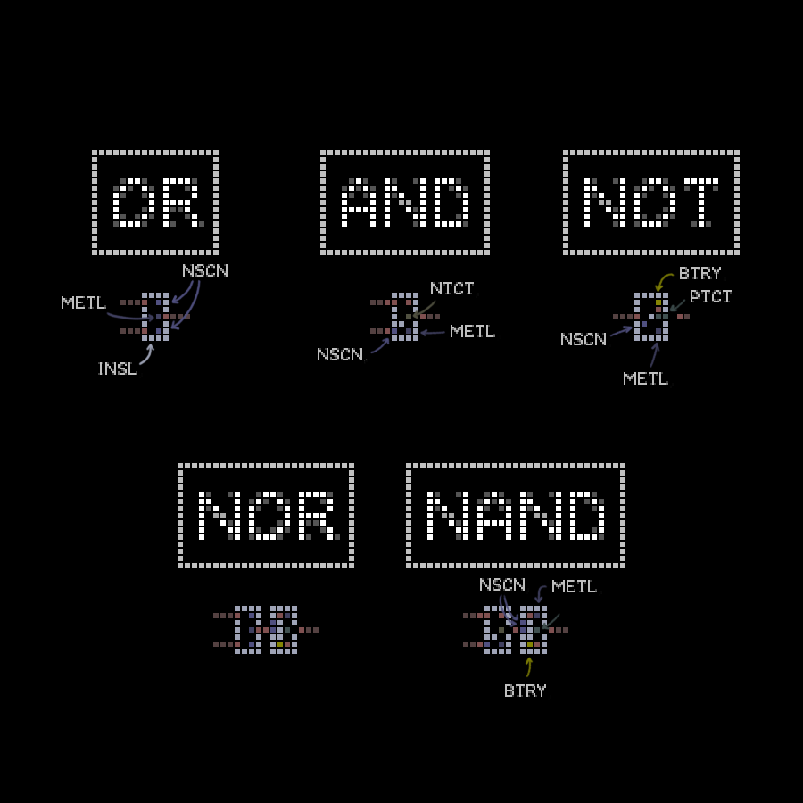

+++
title = "Creating Logic Circuits in Powder Toy"
author = "Javad Hamidi"
date = "2023-08-12"
description = ""
tags = []

+++
Despite having an entire category of materials devoted to electronics, making logic circuits in [The Powder Toy](https://powdertoy.co.uk/) is surprisingly hacky - although definitely possible! [Here's a demo](https://powdertoy.co.uk/Browse/View.html?ID=3030534) I made where the flag only lights up for input `0100111`. Let's go through some tricks to make your own ...



*Make sure you understand what logic gates are and how they work before continuing!* 

Also, familiarise yourself with these handy Powder Toy shortcuts. These will help a lot!

- [Copying & Pasting - The Powder Toy Wiki](https://powdertoy.co.uk/Wiki/W/Clipboard_and_stamps.html)
- ["Zoom?" - The Powder Toy Forum](https://powdertoy.co.uk/Discussions/Thread/View.html?Thread=23827&PageNum=0#Message=310469)
- [Saves - The Powder Toy Wiki](https://powdertoy.co.uk/Wiki/W/Saves.html#Local_saves) 

## Designing a Logic Circuit
Before jumping into Powder Toy, make sure to get/design a circuit for reference. I used [Logic Friday](https://web.archive.org/web/20131022021257/http://www.sontrak.com/) for creating a truth table and then generating a gate diagram (just be wary of dodgy download links). Here's an example:



## Making Logic Gates

The diagram below provides a guide to creating each of the five main gates used in the demo. The goal was to fit each of the basic logic gates (`OR`, `AND`, and `NOT`) in a 4×7 rectangle of blocks, while `NAND` and `NOR` are just a composite of a `NOT` block with an `AND` and `OR` respectively. These gates should work without interference even when stacked directly on top of each other. 

If you want to understand or customise these gates, then here are some tips that might help ...

- Leaving a single block space between conductive blocks produces some strange properties. One block of empty separation vertically or horizontally will still conduct, but a diagonal separation of one block won't work. An insulator in-between will also still block the flow of electricity. 
- Creating an `OR` gate is extremely simple and can be done a variety of ways; there's nothing too special about the materials chosen here or how they're spaced out.
- The `AND` gate works thanks to the `NTCT` material, which only conducts when it is hotter than 100 degrees. Here, both input wires need electricity for the block to get hot enough to become conductive.
- The `NOT` gate works the opposite way; using a `PTCT` block that needs to be cooler than 100 degrees to conduct electricity. So when there is input, the block will get too hot and stop conducting, but when there's no input, the block will be cold enough to pass electricity a the battery block (`BTRY`).
- The `NAND` and `NOR` gates use a more compact, 4×7 variant of the `NOT` gate, but it can be a little less reliable than the 5×7 one provided. 
- The insulating material (`INSL`) around the edges of the gates is largely cosmetic, the insulators within are not!

