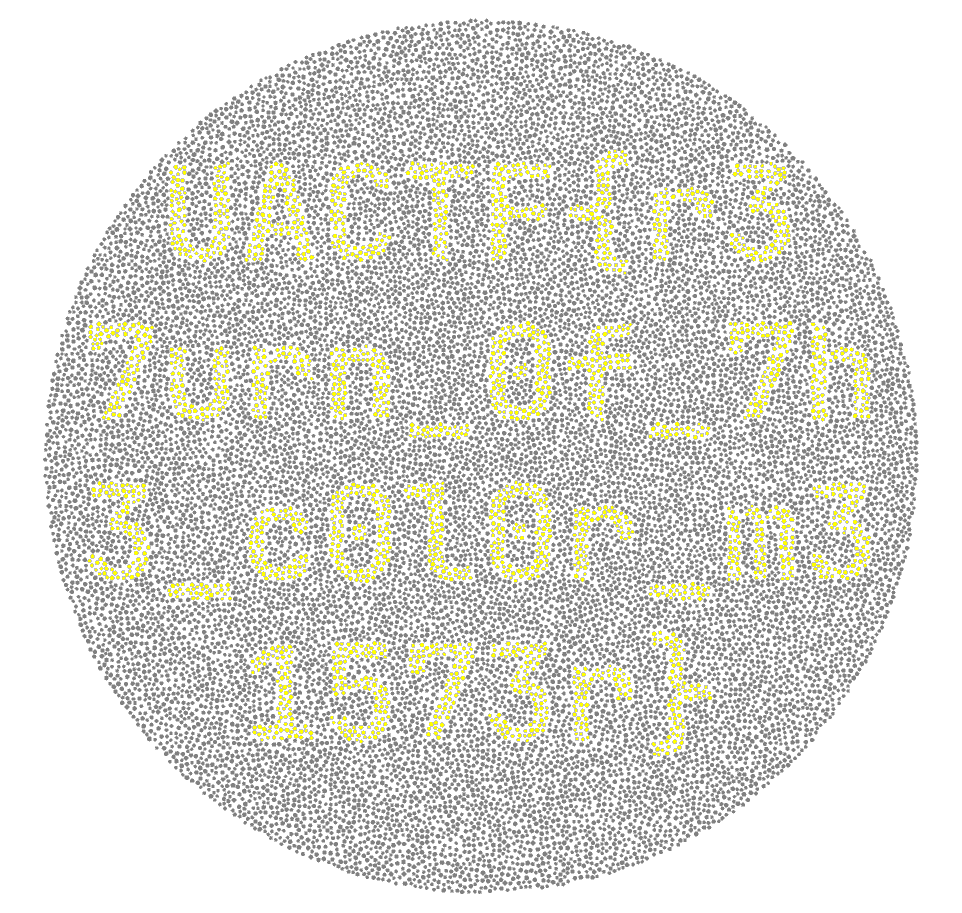

+++
title = "Colour Blind - UACTF 2022"
date = "2022-08-07"
description = "I think my optometrist might be trolling me. Apparently table inspection skills are required?"
author = "Javad Hamidi"
tags = ["Forensics"]

+++
While running the image through stegsolve/stegonline or manipulating the pixels in your favourite image editor won't work, a hex editor should show you that the data portion of the bitmap contains more than two distinct hex values. Checking the image properties should also indicate that `ishihara.bmp` is a 16-color bitmap image, and as such, each hex value denotes a different colour. Hence, we know that the image contains a wider range of colours than are being shown. To figure out why we can't see them, let's explore the [bitmap file format](https://en.wikipedia.org/wiki/BMP_file_format) a bit further by annotating the raw bytes of our challenge file. Note that the bytes highlighted in grey below denote the data portion of the file.

The challenge description and title are collectively intended to hint at checking the bitmap image file's 'color table'. Indeed, if we look at the bytes of the file above, you might notice that 15 of the 16 colours in our colour table have the same value. Altering these values to make them more distinct (hint: these are just typical hex colours in little-endian). That said, there are a lot of paths to figuring out this challenge, and one of the easiest is to simply transplant the header of a working 16-color bitmap onto the challenge file. If you do you'll probably get something close to the original, which is included below:

Thanks to Francisco Couzo for the use of their [Ishihara Plate Generator](https://franciscouzo.github.io/ishihara/).

**Flag**: `UACTF{r37urn_0f_7h3_c0l0r_m31573r}`