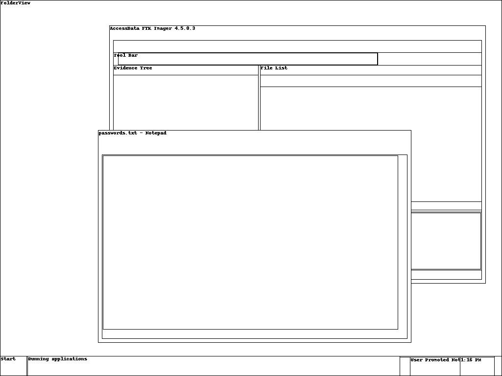

+++
title = "notes - UMassCTF '21"
author = "Javad Hamidi"
date = "2021-03-29"
description = "The breach seems to have originated from this host. Can you find the user's mistake? Here is a memory image of their workstation from that day."
tags = ["Forensics"]

+++
Looking at the .mem file extension, memory forensics - and more specifically [volatility](https://github.com/volatilityfoundation/volatility) - seems like it's going to be our friend here. 

Starting with `volatility -f image.mem imageinfo` we get `Win7SP1x64` as our top suggested image profile (also confirming that we've got a valid dump).

Using one of volatility's coolest features we can use `mkdir shots && volatility -f image.mem --profile=Win7SP1x64 screenshot --dump-dir=shots` to get the following wire-frame screenshot from memory. We now know that the flag was probably open in Notepad, given the hint "There wasn't any suspicious network activity or anything... it's almost as if they just had their passwords up right on the screen." 



To grab the contents from Notepad we'll want to first find it's PID and then get a memory dump of said process to analyse.

`volatility -f image.mem --profile=Win7SP1x64 pslist`

```
Offset(V)          Name                    PID   PPID   Thds     Hnds   Sess  Wow64 Start                        
------------------ -------------------- ------ ------ ------ -------- ------ ------ ------------------------------
...
0xfffffa8000dd0060 notepad.exe            2696   2288      4      309      1      0 2021-03-20 17:59:34 UTC+0000
...
```

`volatility -f image.mem --profile=Win7SP1x64 memdump --dump-dir=./ -p 2696`

Unfortunately, volatility doesn't seem to have a handy plugin to give us whatever text was written into Notepad, so we'll just have to search the resultant dump for any strings that might be part of the flag.

`cat 2696.dmp | strings | grep UMASS` 

No luck, a few more greps later and it's pretty clear that either the flag's not there or it's encoded in a format that would make it difficult to find by simply searching through strings. 

From here a bit of intuition and luck might lead you to the idea that the user may have copied the flag from Notepad onto their clipboard ...

`volatility -f image.mem --profile=Win7SP1x64 clipboard`

```
Session    WindowStation Format                         Handle Object             Data                                              
---------- ------------- ------------------ ------------------ ------------------ --------------------------------------------------
         1 WinSta0       CF_UNICODETEXT               0x5a00b5 0xfffff900c26aeb60   VU1BU1N7JDNDVVIzXyQ3MFJhZzN9Cg==                  
         1 WinSta0       CF_TEXT              0x64006e00000010 ------------------                                                   
         1 WinSta0       0x13c01b7L                        0x0 ------------------                                                   
         1 WinSta0       CF_TEXT                           0x1 ------------------                                                   
         1 ------------- ------------------          0x13c01b7 0xfffff900c06fa270 
```

... and you'd be right, we got some data! Judging by that padding it's base64 encoded. Decoding it gives us the flag `UMASS{$3CUR3_$70Rag3}` 🥳